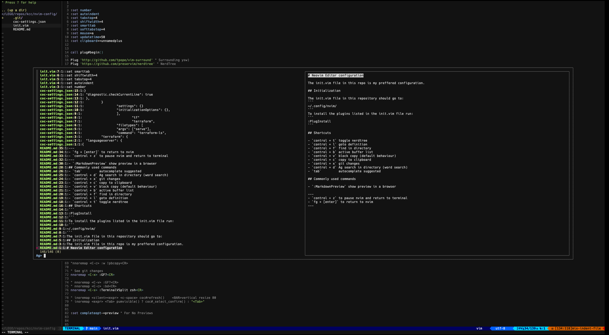

# Neovim Editor configuration

This repository configures Neovim to my preferred setup. 




## Initialization

### Step 1
If you dont have Neovim, first install Neovim

**MacOS**

`brew install neovim`

**Other OS**

Check [neovim's documentation](https://github.com/neovim/neovim/wiki/Installing-Neovim)

---
### Step 2

This repo should be cloned into `~/.config/nvim/`

---

### Step 3

Run
```
sh -c 'curl -fLo "${XDG_DATA_HOME:-$HOME/.local/share}"/nvim/site/autoload/plug.vim --create-dirs \
       https://raw.githubusercontent.com/junegunn/vim-plug/master/plug.vim'
```

### Step 4

To install the plugins listed in the init.vim file run:
```
:PlugInstall
```

### Step 5

Install lsp-config
```
git clone https://github.com/neovim/nvim-lspconfig ~/.config/nvim/pack/nvim/start/nvim-lspconfig
```

### Step 6
Install all the lsp servers

- Python
`npm i -g pyright`

- Terraforn
`brew install hashicorp/tap/terraform-ls`

- Lua
`brew install lua-language-server`

## Shortcuts

- `<Leader>t` toggle nerdtree
- `<Leader>p` goto definition
- `<Leader>o` go back (inverse goto definition)
- `<Leader>f` Ag search. Global word search
- `<Leader>b` active buffer list
- `<Leader>g` git changes 
- `<Leader>d` Search directory (file) names 
- `Enter`         autocomplete suggested
- `Control + Space` (insert mode) Show fields / autocomplete
- `control + v` block copy (default behaviour) 
- `control + c` copy to clipboard 

- `<Leader>s`		Move to beginning
- `<Leader>l`		Move to end

- `<Leader>cc` Comment single line
- `<Leader>cx` Uncomment single line
- `<Leader>cb` Comment previous visual block
- `<Leader>cv` Uncomment previous visual block

- `gd` GoTo definition
- `gi` GoTo implementation 
- `gr` List and GoTo referenced instances 
- `gt` GoTo type definition 

- `<Leader>r` format selected code

- `<Leader>wH` move window left
- `<Leader>wJ` move window down 
- `<Leader>wK` move window up
- `<Leader>wL` move window right

## Commonly used commands

- `:MarkdownPreview` show preview in a browser 
- `Control + z` to pause nvim and return to terminal
- `fg + Enter` to return to nvim
- To indent multiple times:
	- select block
	- `>>`    (this will indent once)
	- `.`     (dot redo last command)

## Useful movement tips

- H		move top of the screen
- M		move middle of the screen
- L		move bottom of the screen
- mx	mark current line
- 'x	jump to mark

# Custom Lua Plugins

The custom lua plugins are separated into the following categories

## Foundation
This folder contains the foundational plugins that make Neovim act the way I want it to.
Currently it contains:
- **refresh_change**: Refreshes the buffer when there is a change in the buffer.

## Linters
This folder contains all the language specific linters and formatters.
Currently it contains:

- **python_black**: On saving a python file, uses __black__ to format the file.
- **terraform_fmt**: On saving a terraform file, it formats the tf file.

